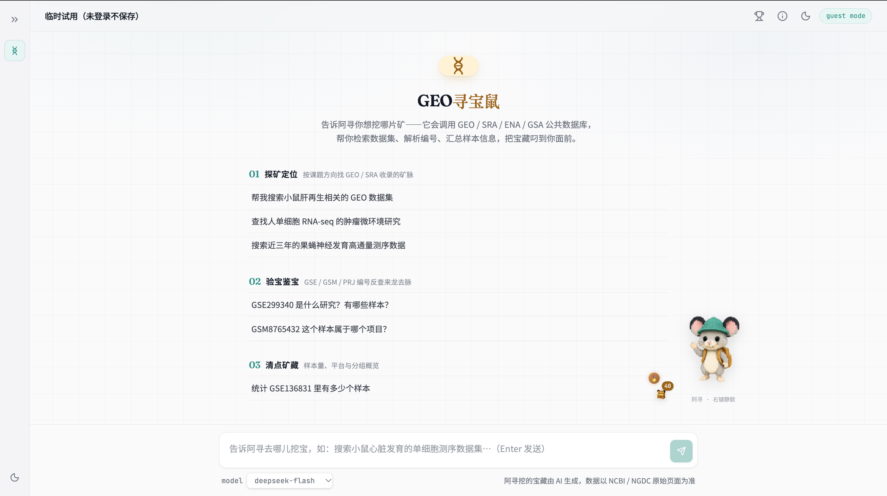

<div align="center">
  
  <h1>GEO寻宝鼠 · 对话式组学数据检索助手</h1>
  <p>
    <a href="https://render.qmuse.pub/p/muse/2842191818002612/index.html"></a>
    
    
    
    <a href="https://github.com/xsx123123/JZ_Tools/blob/main/LICENSE"></a>
  </p>
  <p>🚀 <a href="https://render.qmuse.pub/p/muse/2842191818002612/index.html"><strong>在线体验</strong>：https://render.qmuse.pub/p/muse/2842191818002612/index.html</a>（线上部署版本可能落后于仓库最新代码）</p>
  <p>把 <a href="https://github.com/xsx123123/JZ_Tools/tree/main/src/seqout-mcp">seqout-mcp</a> 的 26 个组学数据检索工具封装成「聊天式挖宝」——自然语言提问，大模型自动检索 GEO / SRA / ENA / GSA，数据卡片 + 文献证据链呈现，附桌宠养成玩法。</p>
</div>

> **备注**：本项目对话后端封装的 [seqout-mcp](https://github.com/xsx123123/JZ_Tools/tree/main/src/seqout-mcp) 是一个通过 [seqout.org](https://seqout.org) 查询公共组学数据的 MCP Server，提供 26 个只读工具，覆盖 GEO、SRA、ENA、GSA 数据集搜索、项目详情、样本信息、编号反查、统计和下载链接。它使用 stdio 传输：MCP 客户端负责启动进程并通过标准输入/输出通信；普通日志只写入 stderr，不会污染 MCP 协议数据。本应用将这套工具能力以 OpenAI function schema 声明式移植进对话服务，无需在本地运行 Python MCP 进程。


**界面预览**（自托管模式 + DeepSeek 模型，纯游客运行）：



---

## 快速开始

### Docker 部署（推荐，无需本机 Node/pnpm/nginx）

```bash
cp server/.env.example server/.env   # 填入 LLM_API_KEY（OpenAI / DeepSeek / 硅基流动 / 本地 vLLM 均可）
make docker-start                    # 预检密钥 → 构建 → 启动
```

打开 `http://localhost:8080/`（端口由 `server/.env` 的 `WEB_PORT` 控制），发一条消息能看到流式回复即成功。常用命令：`make docker-stop` / `make docker-restart` / `make docker-logs`（`make` 查看全部）。

### 本地开发

```bash
pnpm install
pnpm run server    # 本地对话服务（读 server/.env 的密钥与端口）
pnpm run dev       # 前端 dev server（固定 3015 端口）
```

环境变量唯一来源是 `server/.env`：本地开发与 Docker 部署共用（vite `envDir` 指向 `server/`，Makefile 起容器带 `--env-file server/.env`），`VITE_*` 构建期变量与 `LLM_*`/`WEB_PORT` 等运行时变量都写在这一份里。

## 功能一览

- **对话式检索**：自然语言提问 → LLM tool-calling 自动选择 seqout 工具（26 个只读工具，GEO/SRA/ENA/GSA）→ 流式回答 + 数据卡片 + 「下一铲建议」
- **正文内嵌链接**：GSE/GSM/GO/PMID 编号自动变成可点链接，hover 浮层预取论文元数据，一键查看文献证据链（PubMed 摘要 + DOI / OA 全文）
- **排行榜**：登录用户榜 + 访客榜，本周 / 累计双维度，自定义昵称
- **使用统计**：顶栏 📊 面板展示累计对话、Token 消耗、使用人数、每个工具的调用次数（服务端聚合，容器内持久化）
- **桌宠与成就**：寻宝鼠随检索进度挖宝，累计挖宝解锁成就徽章
- **移动端自适应**：软键盘、安全区、触摸交互全适配

## 技术栈

React 19 + TypeScript · Vite 7 · Tailwind CSS v4（双主题 design token）· TanStack Router · Supabase 兼容后端（可选，不配自动降级纯游客模式）· 任意 OpenAI 兼容 LLM 网关 · Docker Compose（nginx + Node 双容器）

## 目录

| 位置 | 内容 |
|------|------|
| `docs/DETAILED_README.md` | **详细开发文档**：目录结构、核心架构与数据流、平台部署（Meoo）、手动部署、systemd、踩坑清单 |
| `src/routes/about.tsx` | 应用内「关于」页（产品介绍） |
| `deploy/` | Docker 部署（Dockerfile 双 target + compose + nginx + Makefile） |
| `server/` | 自托管对话服务（Node 原生跑 Edge Function 的 handler，零依赖） |

详细架构说明、Meoo 平台发布流程、手动部署步骤与常见问题排查，请见 **[docs/DETAILED_README.md](docs/DETAILED_README.md)**。

---

## 致谢

本应用基于 QMuse 构建与部署，并在 DeepSeek-V4、Kimi-K3、GLM-5.3 等 AI 模型的协助下开发完成。

<p>
  <a href="https://www.qmuse.cn/" target="_blank" rel="noreferrer"></a>&nbsp;&nbsp;
  <a href="https://www.deepseek.com/" target="_blank" rel="noreferrer"></a>&nbsp;&nbsp;
  <a href="https://www.kimi.com/" target="_blank" rel="noreferrer"></a>&nbsp;&nbsp;
  <a href="https://chat.z.ai/" target="_blank" rel="noreferrer"></a>
</p>
