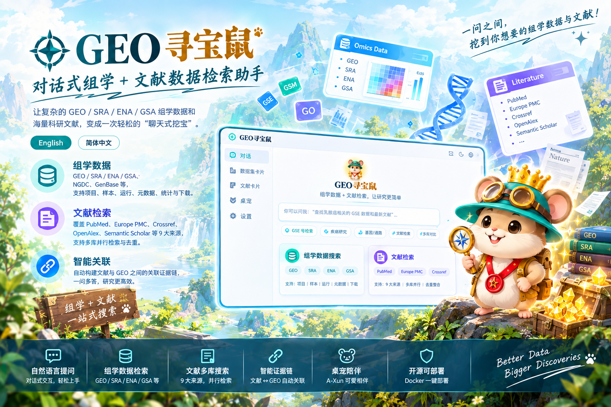

<div align="center">
  
  <h1>Research Treasure Mouse</h1>
  <p>Conversational omics data and literature search for research workflows</p>
  <p><strong>English</strong> | <a href="docs/README.zh-CN.md">简体中文</a></p>
  <p>🚀 <a href="https://render.qmuse.pub/p/muse/2842191818002612"><strong>Try the online demo</strong></a>: https://render.qmuse.pub/p/muse/2842191818002612</p>
  <p>
    
    
    
    
  </p>
</div>

Research Treasure Mouse is a chat-based research assistant for finding public omics datasets and research literature. Ask a question in natural language; the backend selects the appropriate read-only tool, queries the source API, and returns a concise answer with structured dataset or paper cards. Literature searches can run across multiple indexes and are automatically connected to related GEO identifiers, studies and papers when the evidence supports that link.

The project is designed for self-hosting. Any OpenAI-compatible model gateway can be used, and the frontend can run as a guest without Supabase. The Chinese product name is **科研寻宝鼠**; its desk pet is called **A-Xun** (阿寻).



## What It Searches

### Omics data

- GEO, SRA, ENA and GSA through the [seqout](https://seqout.org) read-only API
- NGDC Genome Warehouse and GenBase public endpoints
- Project, sample, run, accession, metadata, statistics and download-link queries

### Literature

The `literature_search` tool supports nine sources:

- PubMed through NCBI E-utilities
- Europe PMC
- Crossref
- OpenAlex
- Semantic Scholar
- CORE
- arXiv
- bioRxiv
- medRxiv

`source=all` queries all nine sources in parallel, then de-duplicates records by DOI, PMID or title. A single source can be selected when a query needs a specific index. Google Scholar is exposed only as an outbound search link; it is not scraped or used as an API backend.

## Evidence Chain

When a user asks about a GSE, GSM, PMID or GO term, the application can build an evidence chain instead of guessing. Literature results can also be aligned with related GEO studies when identifiers, titles or metadata provide a reliable match:

1. Resolve the identifier through the authoritative database fields.
2. Query the relevant literature indexes for the exact linked paper or identifier.
3. Use Europe PMC and other available sources to enrich abstracts, DOI metadata and open-access full-text links.
4. Return the title, authors, journal, year, DOI, abstract outline, source links and related GEO context.

The active literature search returns normalized paper cards, while the evidence-chain lookup remains optimized for one identifier or one dataset.

## Features

- Natural-language tool calling with streamed SSE responses
- Dataset cards and normalized paper cards with source links
- GSE/GSM/GO/PMID links that open metadata or literature evidence
- Nine-source literature search: PubMed, Europe PMC, Crossref, OpenAlex, Semantic Scholar, CORE, arXiv, bioRxiv and medRxiv
- Automatic literature-to-GEO alignment for evidence discovery
- Guest mode with local sessions; optional Supabase or self-hosted accounts
- Login history, leaderboard and usage statistics in self-hosted mode
- Draggable desk pet, activity states and achievement badges
- Light and dark themes with responsive mobile layout
- Docker deployment with nginx, gzip and `/stats` health checks

## Quick Start

### Docker (recommended)

```bash
cp server/.env.example server/.env
```

Edit `server/.env` and set an OpenAI-compatible model key at minimum:

```env
LLM_API_KEY=your_llm_key
LLM_BASE_URL=https://api.deepseek.com
LLM_MODEL=qwen3.8-flash
```

Start the two-container deployment:

```bash
make docker-start
```

Open `http://localhost:10087/`. Change `WEB_PORT` in `server/.env` when that port is unavailable. Useful commands are `make docker-status`, `make docker-logs`, `make docker-restart` and `make docker-stop`.

### Local development

```bash
pnpm install
pnpm run server    # chat service, reads server/.env
pnpm run dev       # Vite frontend at http://localhost:3015
```

`server/.env` is the single configuration source for local development and Docker. The Vite config reads its `VITE_*` values from that directory.

## Literature API Configuration

All literature credentials are server-side only. Never put them in frontend code or commit `server/.env`.

```env
# Recommended for PubMed. The API key raises the request-rate allowance.
NCBI_EMAIL=your-real-email@example.com
NCBI_API_KEY=your_ncbi_api_key

# Optional polite-pool contact for Crossref and OpenAlex.
CROSSREF_MAILTO=your-real-email@example.com
OPENALEX_MAILTO=your-real-email@example.com

# Optional provider keys.
OPENALEX_API_KEY=your_openalex_api_key
SEMANTIC_SCHOLAR_API_KEY=your_semantic_scholar_api_key
CORE_API_KEY=your_core_api_key
```

PubMed and Europe PMC can work without keys. `NCBI_EMAIL` is recommended, while `NCBI_API_KEY` is useful for higher request volume. Crossref, OpenAlex, arXiv, bioRxiv and medRxiv support public basic access; contact email improves rate-limit handling where supported. Semantic Scholar works without a key at lower limits. CORE requires `CORE_API_KEY` for its API.

## Architecture

```text
Browser
  -> React/Vite frontend
  -> SSE chat endpoint
  -> Node self-hosted service or platform Edge Function
       -> OpenAI-compatible LLM tool-calling loop
       -> seqout / NGDC / literature provider APIs
```

The backend keeps provider credentials private, normalizes provider-specific responses into one paper schema, and sends cards separately from the model context. The frontend renders the stream, cards, evidence links and pet events.

Important locations:

| Path | Responsibility |
| --- | --- |
| `functions/seqout-chat/index.ts` | Tool schemas, provider adapters and SSE orchestration |
| `functions/seqout-chat/prompts/` | Editable Chinese and English system prompts |
| `src/services/seqoutChat.ts` | SSE client and event parsing |
| `src/components/chat/DatasetCard.tsx` | Dataset and paper cards |
| `server/local.mjs` | Node self-hosted chat service |
| `server/account-api.mjs` | Local accounts, history and leaderboard APIs |
| `deploy/` | Dockerfile, compose and nginx configuration |
| `docs/literature-search-and-evidence-chain.md` | Literature integration and evidence-chain design |

## Development Checks

```bash
npm run sync:prompts
npx tsc --noEmit
npm test
npx vite build
```

`npm test` runs offline fixtures. `npm run test:live` additionally checks the live seqout API and requires network access.

## Documentation

- [中文 README](docs/README.zh-CN.md)
- [Literature search and evidence-chain design](docs/literature-search-and-evidence-chain.md)
- [Detailed development documentation](docs/DETAILED_README.md)
- [Architecture notes](docs/ARC/architecture-2026-10-06.md)
- [Technical and engineering white paper](docs/寻宝鼠_技术与工程设计白皮书_v1.docx)

## License and Credits

The project is developed by JZHANG and uses the seqout public data service, NGDC public APIs and OpenAI-compatible model gateways. See the repository license for redistribution terms.
