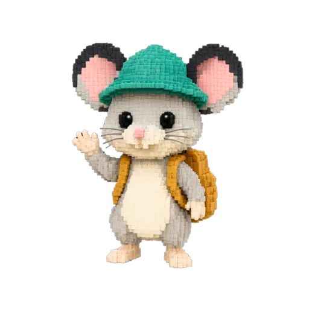
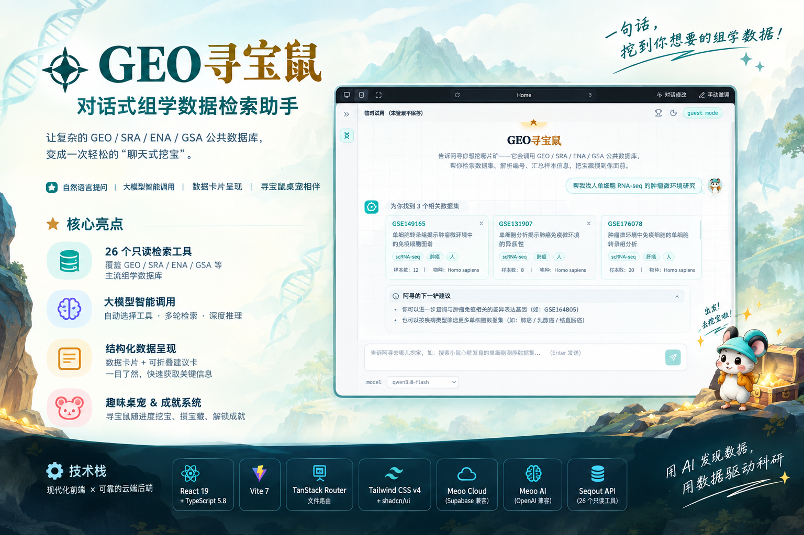

<div align="center">
  
  <h1>GeoMuse · Conversational Omics Data Explorer</h1>
  <p>
    <strong>English</strong> | <a href="docs/README.zh-CN.md">简体中文</a>
  </p>
  <p>
    <a href="https://render.qmuse.pub/p/muse/2842191818002612/index.html"></a>
    
    
    
    <a href="https://github.com/xsx123123/JZ_Tools/blob/main/LICENSE"></a>
  </p>
  <p>🚀 <a href="https://render.qmuse.pub/p/muse/2842191818002612/index.html"><strong>Live demo</strong>: https://render.qmuse.pub/p/muse/2842191818002612/index.html</a> (the deployed version may lag behind the latest repo code)</p>
  <p>Wraps the 26 omics data-retrieval tools of <a href="https://github.com/xsx123123/JZ_Tools/tree/main/src/seqout-mcp">seqout-mcp</a> into a "chat-style treasure hunt" — ask in natural language, and the LLM automatically searches GEO / SRA / ENA / GSA, presenting results as data cards plus a literature evidence chain, with a virtual pet to raise on the side.</p>
</div>

> **Note**: The chat backend wraps [seqout-mcp](https://github.com/xsx123123/JZ_Tools/tree/main/src/seqout-mcp), an MCP Server that queries public omics data through [seqout.org](https://seqout.org). It exposes 26 read-only tools covering GEO, SRA, ENA and GSA dataset search, project details, sample info, accession lookup, statistics and download links. It uses stdio transport: the MCP client launches the process and communicates over stdin/stdout; ordinary logs go to stderr only and never pollute the MCP protocol stream. This app ports those tool capabilities declaratively into the chat service as OpenAI function schemas — no local Python MCP process required.



**UI preview** (self-hosted mode + DeepSeek model, running as a guest):


---

## Documentation

- [中文说明（简体中文版 README）](docs/README.zh-CN.md)
- [Detailed development docs](docs/DETAILED_README.md)

## Quick start

### Docker deployment (recommended — no local Node/pnpm/nginx needed)

```bash
cp server/.env.example server/.env   # fill in LLM_API_KEY (OpenAI / DeepSeek / SiliconFlow / local vLLM all work)
make docker-start                    # precheck key → build → start
```

Open `http://localhost:8080/` (the port is controlled by `WEB_PORT` in `server/.env`) — you're set up once a message returns a streamed reply. Common commands: `make docker-stop` / `make docker-restart` / `make docker-logs` (`make` lists them all).

### Local development

```bash
pnpm install
pnpm run server    # local chat service (reads keys and port from server/.env)
pnpm run dev       # frontend dev server (fixed to port 3015)
```

Environment variables have a single source of truth: `server/.env`. Local development and Docker deployment share the same file (Vite's `envDir` points at `server/`, and the Makefile starts containers with `--env-file server/.env`). Both build-time `VITE_*` variables and runtime `LLM_*`/`WEB_PORT` variables live in this one file.

## Features

- **Conversational retrieval**: ask in natural language → LLM tool-calling automatically picks seqout tools (26 read-only tools, GEO/SRA/ENA/GSA) → streamed answer + data cards + "next dig" suggestions
- **Inline linked accessions**: GSE/GSM/GO/PMID accessions automatically become clickable links; a hover popover prefetches paper metadata, and one click opens the literature evidence chain (PubMed abstract + DOI / OA full text)
- **Leaderboard**: signed-in users board + guest board, weekly / all-time views, custom nicknames
- **Usage stats**: a 📊 panel in the top bar showing total chats, token usage, user count and per-tool call counts (aggregated server-side, persisted inside the container)
- **Virtual pet & achievements**: the treasure mouse digs as retrieval progresses, and cumulative digging unlocks achievement badges
- **Mobile adaptive**: soft keyboard, safe areas and touch interactions fully adapted

## Tech stack

React 19 + TypeScript · Vite 7 · Tailwind CSS v4 (dual-theme design tokens) · TanStack Router · Supabase-compatible backend (optional; falls back to guest-only mode when unconfigured) · any OpenAI-compatible LLM gateway · Docker Compose (nginx + Node, two containers)

## Layout

| Location | Contents |
|----------|----------|
| `docs/DETAILED_README.md` | **Detailed development docs**: directory structure, core architecture and data flow, platform deployment (Meoo), manual deployment, systemd, pitfalls |
| `src/routes/about.tsx` | In-app "About" page (product intro) |
| `deploy/` | Docker deployment (dual-target Dockerfile + compose + nginx + Makefile) |
| `server/` | Self-hosted chat service (runs the Edge Function handler natively on Node, zero dependencies) |

For detailed architecture notes, the Meoo platform release process, manual deployment steps and troubleshooting, see **[docs/DETAILED_README.md](docs/DETAILED_README.md)**.

---

## Acknowledgements

This app is built and deployed on QMuse, and was developed with assistance from AI models including DeepSeek-V4, Kimi-K3 and GLM-5.3.

<p>
  <a href="https://www.qmuse.cn/" target="_blank" rel="noreferrer"></a>&nbsp;&nbsp;
  <a href="https://www.deepseek.com/" target="_blank" rel="noreferrer"></a>&nbsp;&nbsp;
  <a href="https://www.kimi.com/" target="_blank" rel="noreferrer"></a>&nbsp;&nbsp;
  <a href="https://chat.z.ai/" target="_blank" rel="noreferrer"></a>
</p>

---

## 🔗 Links

**Author**: JZHANG | **Version**: GeoMuse_v0.1.1

- GitHub: [repository](https://github.com/xsx123123/JZ_Tools)
- LINUX DO: [Announcement](https://linux.do/)
