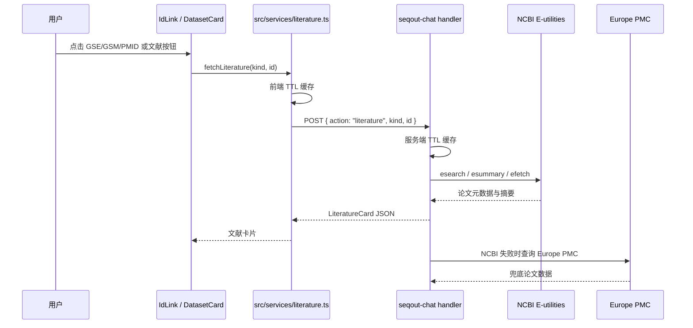

# 文献搜索与证据链设计说明

> 状态：已落地能力说明 + 后续演进建议
>
> 适用范围：科研寻宝鼠的多源文献检索、GEO 文献联动与证据链能力。

## 1. 结论

当前项目已经接入九个文献来源，并同时提供编号关联证据链与主动关键词文献搜索：PubMed、Europe PMC、Crossref、OpenAlex、Semantic Scholar、CORE、arXiv、bioRxiv、medRxiv。

现有能力可以：

- 点击 `GSE`、`GSM`、`PMID`、`GO` 编号；
- 获取关联论文的标题、期刊、年份、PMID、DOI 和摘要分段；
- 并行查询多个来源，按 DOI、PMID 或标准化标题去重；
- 在单个来源失败或限流时保留其他来源结果，并在响应中记录 warning；
- 在数据集卡片或正文编号下打开文献证据链卡片；
- 提供 PubMed、DOI、来源页和开放获取全文链接；
- 根据编号、标题和元数据将文献结果与相关 GEO 研究自动对齐。

主动搜索已通过独立的 `literature_search` 工具接入当前对话服务和 SSE 架构，与编号证据链保持分工，避免把多篇论文检索逻辑混入单编号详情链。

## 2. 数据源选择

### 2.1 PubMed / NCBI E-utilities

PubMed 是生物医学文献的权威入口，适合做精确检索和 PMID 详情查询。当前使用的接口包括：

- `esearch.fcgi`：关键词检索 PMID 列表；
- `esummary.fcgi`：获取标题、期刊、出版日期和 DOI；
- `efetch.fcgi`：获取结构化摘要。

官方文档：

- [NCBI APIs](https://www.ncbi.nlm.nih.gov/home/develop/api/)
- [E-utilities 使用说明](https://www.ncbi.nlm.nih.gov/books/NBK25497/)

请求应携带 `tool`，部署环境建议配置 `NCBI_EMAIL`，有条件时配置 `NCBI_API_KEY`。当前实现根据是否配置 API Key 使用不同的令牌桶速率，并在 429/5xx 时做退避重试。

### 2.2 Europe PMC

Europe PMC 提供正式 REST API，覆盖 PubMed 内容，并额外提供开放获取全文地址、引用关系和更丰富的文章字段。当前项目将它作为 NCBI 的降级数据源。

官方文档：[Europe PMC RESTful Web Service](https://europepmc.org/RestfulWebService)

当前使用搜索接口：

```text
GET https://www.ebi.ac.uk/europepmc/webservices/rest/search
  ?query=...
  &format=json
  &resultType=core
```

Google Scholar 不作为后端抓取源。它没有适合作为生产依赖的官方公共搜索 API，自动化访问还受批量访问和 `robots.txt` 约束。产品可以生成 Google Scholar 外链供用户手动打开，但不应依赖爬虫或不稳定的第三方接口。

## 3. 当前证据链实现

### 3.1 总体链路



### 3.2 后端入口

入口在 `functions/seqout-chat/index.ts` 的 `handler`：

```json
{
  "action": "literature",
  "kind": "geo_series | geo_sample | go_term | pubmed",
  "id": "GSE117176"
}
```

这个分支在 AI 凭证校验之前执行，因为文献查询只访问公共 API，不需要 LLM Key。参数校验失败返回 `400`，公共 API 链路失败返回 `502`。

当前允许的 `kind`：

| kind | 输入 | 检索策略 |
|---|---|---|
| `geo_series` | `GSE...` | 先读取 seqout 项目详情中的 `pubmed_id`，没有时按 `GSE... [Title]` 搜索 |
| `geo_sample` | `GSM...` | 先通过 seqout 反查所属 GSE，再读取 GSE 的 `pubmed_id` |
| `pubmed` | `PMID...` | 直接走 `esummary` + `efetch`，不做关键词搜索 |
| `go_term` | `GO:...` | 按 GO 编号和 Gene Ontology 标题构造检索词 |

### 3.3 GEO 关联文献的精确优先策略

GEO 项目通常自带关联 PMID。当前实现优先使用项目详情中的 `pubmed_id`，避免直接用宽泛关键词命中无关论文。

对于 `GSM`：

1. 调用 seqout 的 `/accession/{GSM}/project`；
2. 得到所属 `GSE`；
3. 调用 `/project/{GSE}`；
4. 读取该项目的 `pubmed_id`；
5. 如果没有 PMID，再退回 `GSE... [Title]` 检索。

这条链路的意义是：样本自身往往不挂论文，论文关系通常挂在 GEO Series 层级。

### 3.4 NCBI 查询步骤

#### PMID 直接查询

对于 `kind=pubmed`：

1. 去掉 `PMID:` 前缀；
2. `esummary` 获取标题、期刊、出版日期和 DOI；
3. `efetch` 获取摘要 XML；
4. 从 `AbstractText` 标签中提取分段；
5. 没有 `Label` 时统一显示为 `Abstract`。

#### 关键词查询

对于 GEO、GO 等编号：

1. 构造受约束的检索词；
2. `esearch` 获取最多 3 个 PMID；
3. 当前选择第一个结果作为关联论文；
4. `esummary` 获取论文元数据；
5. `efetch` 获取结构化摘要。

当前实现只展示一篇关联论文，这是“证据链”而不是“搜索结果列表”。

### 3.5 Europe PMC 降级

当 NCBI 发生以下情况时进入 Europe PMC：

- 429 限流；
- 5xx 服务错误；
- 多次重试后仍失败；
- NCBI 请求超时或网络错误。

当前降级查询格式为：

```text
DOI:"输入编号" OR EXT_ID:输入编号
```

Europe PMC 返回后会提取：

- 标题；
- PMID；
- 期刊和年份；
- DOI；
- 摘要；
- 开放获取全文或 PDF 地址。

如果两条链路都没有结果，返回 `status: "not_found"`。这被视为正常业务结果，不当成服务错误。

## 4. 限流、重试与缓存

### 4.1 NCBI 令牌桶

后端维护进程内令牌桶：

- 无 API Key 时目标速率约为 2.5 req/s，给官方 3 req/s 建议留余量；
- 有 API Key 时目标速率约为 9.5 req/s，给官方 10 req/s 建议留余量；
- 没有令牌时不排队，直接让调用进入 Europe PMC 降级路径。

这能避免多个用户同时悬停编号时把 NCBI 请求堆积在函数实例里。

### 4.2 重试策略

`fetchWithRetry()` 对 429 和 5xx 进行最多三次重试，等待时间按 1s、2s、4s 递增。每次请求有 6s AbortController 超时。

### 4.3 后端缓存

后端缓存是 Edge/Node 进程实例级：

- 成功结果缓存 30 天；
- 未找到结果缓存 7 天；
- 最多保留 2000 条，超出后删除较早的一半。

缓存 key 包含策略版本号：

```text
v1:{kind}:{id}
```

修改检索策略时递增版本号，旧结果会自然失效。

### 4.4 前端缓存

`src/services/literature.ts` 还有一层浏览器内存缓存：

- 成功结果 10 分钟；
- 未找到结果 5 分钟；
- 最多保留 300 条，超出后缩减到 200 条。

因此用户反复 hover 同一个编号时不会重复打后端。

## 5. 前端证据链展示

### 5.1 正文编号

`src/lib/linkify.ts` 扫描 Markdown 文本中的：

- `GSE...`
- `GSM...`
- `GO:...`
- `PMID:...`

`IdLink` 负责：

1. 将编号变成原始数据库链接；
2. hover 或触摸点击时预取论文元数据；
3. 显示加载骨架、标题、期刊和年份；
4. 提供“查看证据链”入口；
5. 允许复制编号和打开原始页面。

### 5.2 数据集卡片

`DatasetCard` 对 `GSE` 和 `GSM` 显示书本图标。点击后通过 `evidenceBus` 向消息列表发出请求，由 `ChatMessage` 在对应消息下方挂载 `LiteratureCardPanel`。

这样文献证据链会紧贴触发它的数据集卡片，不会跑到页面底部或丢失上下文。

### 5.3 文献卡片数据结构

当前返回结构：

```ts
interface LiteratureCard {
  status: "ok" | "not_found";
  pmid?: string;
  title?: string;
  journal?: string;
  year?: string;
  doi?: string;
  outline?: { section: string; text: string }[];
  urls?: {
    pubmed?: string;
    doi?: string;
    full_text?: string;
  };
  suggested_queries?: string[];
}
```

摘要只展示前端允许的分段和长度，避免把完整 XML 或过长摘要直接塞进聊天上下文。

## 6. 当前能力边界

以下仍属于后续演进方向：

- 更完整的分页或游标体验；
- 按年份、作者、期刊或开放获取过滤；
- 按相关性、年份或引用数排序；
- 论文结果卡片批量导出；
- 从论文结果反查 GEO、SRA 或 NGDC 数据集的专用工具。

因此产品文案可以同时使用“多源文献搜索”和“文献证据链”，但不应将其宣传成覆盖所有学术数据库的通用搜索引擎。

## 7. 主动文献搜索接口与后续演进

当前使用独立工具：

```text
literature_search
```

建议参数：

| 参数 | 类型 | 说明 |
|---|---|---|
| `query` | string | 关键词、短语或 PubMed 查询式 |
| `source` | enum | `all`、`pubmed`、`europe_pmc`、`crossref`、`openalex`、`semantic_scholar`、`core`、`arxiv`、`biorxiv`、`medrxiv` |
| `year_from` | number | 起始年份，可选 |
| `year_to` | number | 结束年份，可选 |
| `author` | string | 作者过滤，可选 |
| `open_access_only` | boolean | 只返回开放获取，可选 |
| `limit` | number | 每页数量，建议最大 20 |
| `cursor` | string | 分页游标，可选 |

推荐返回统一结构：

```ts
interface LiteratureSearchResult {
  source: "pubmed" | "europe_pmc" | "crossref" | "openalex" | "semantic_scholar" | "core" | "arxiv" | "biorxiv" | "medrxiv";
  id: string;
  title: string;
  authors?: string[];
  journal?: string;
  year?: string;
  abstract?: string;
  pmid?: string;
  doi?: string;
  isOpenAccess?: boolean;
  urls: {
    pubmed?: string;
    europe_pmc?: string;
    doi?: string;
    full_text?: string;
    google_scholar_search?: string;
  };
}
```

当前执行流程：

1. `source=all` 时并行查询九个来源，单源失败降级为 warning；
2. 将各来源结果归一化，按 DOI、PMID、标准化标题去重；
3. 结果截断到请求限制后进入 LLM，完整论文卡片通过独立 `cards` SSE 事件发送给前端；
4. 前端显示多论文列表，单篇点击后复用现有证据链卡片，并尝试关联 GEO 研究。

### 7.1 与现有对话工具的关系

主动搜索应进入 `TOOL_DEFS` / `executeTool()`，由模型根据用户意图调用。例如：

- “找近五年肝癌单细胞 RNA-seq 的论文” → `literature_search`；
- “这个 GSE 的关联论文是什么” → 现有 `action: literature` 证据链；
- “这个 PMID 的摘要” → 现有 `action: literature` 详情链；
- “找论文里对应的公开数据集” → 后续再增加论文到数据集反查能力。

两条链路共用 NCBI 限流和缓存基础设施，但返回模型不同：证据链返回单篇 `LiteratureCard`，主动搜索返回结果集合。

## 8. 命名建议

接入主动文献搜索后，`GEO寻宝鼠` 会显得过窄。建议把 GEO 从品牌名降为数据源之一。

推荐品牌层级：

```text
主品牌：科研寻宝鼠
产品描述：AI 组学与文献检索助手
桌宠：阿寻
```

英文可对应：

```text
Research Treasure Mouse
AI Omics & Literature Assistant
```

迁移时应同步更新：

- `index.html` 的 `<title>`；
- `src/i18n/locales/zh.ts` 和 `en.ts` 的 `brand.*`、登录、关于页文案；
- `README.md` 与 `docs/README.zh-CN.md`；
- `src/routes/about.tsx` 使用的关于页文案；
- 页面无障碍标题、图片 alt 和应用版本文案。

不建议将品牌命名为“Google Scholar 搜索器”或“PubMed 搜索器”，避免被单一平台覆盖范围和接口政策限制。

## 9. 实施顺序建议

1. 继续完善九源适配器的测试、限流和监控；
2. 增加多论文卡片的分页、筛选和来源标签；
3. 增加“论文 → 数据集”反查入口；
4. 持续统一品牌和 README 文案。

这样可以先扩展实际能力，再做名称迁移，避免产品名先变宽但功能仍停留在 GEO 关联文献阶段。
